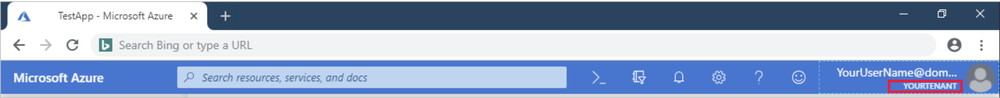
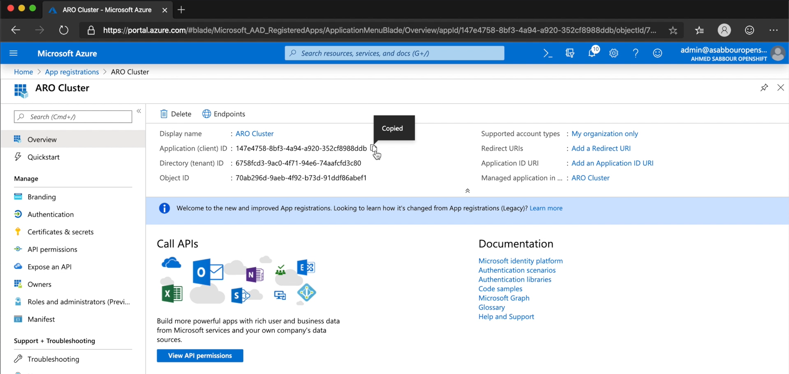
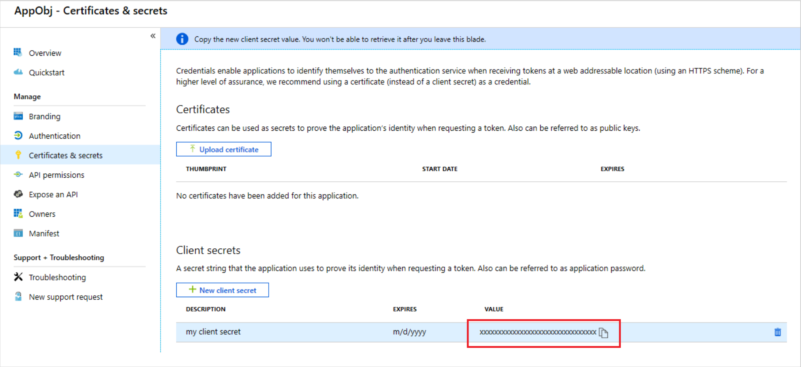
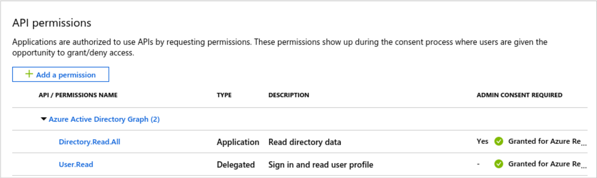
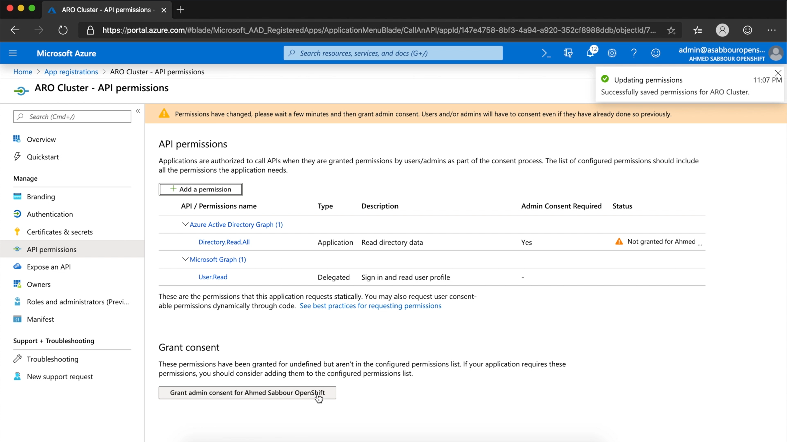
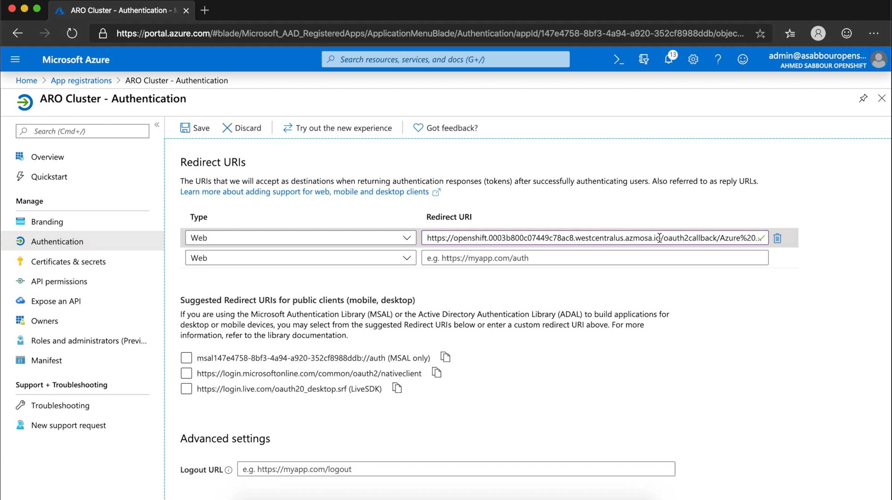

### Create an Azure Active Directory tenant for your cluster 

Microsoft Azure Red Hat OpenShift requires an [Azure Active Directory (Azure AD)](https://docs.microsoft.com/en-us/azure/active-directory/develop/quickstart-create-new-tenant) tenant to create your cluster. A tenant is a dedicated instance of Azure AD that an organization or app developer receives when they create a relationship with Microsoft by signing up for Azure, Microsoft Intune, or Microsoft 365. Each Azure AD tenant is distinct and separate from other Azure AD tenants and has its own work and school identities and app registrations.

If you have **Administrator** access to your organization's Azure Active Directory (unlikely), you can skip this step. Otherwise, follow these instructions to create one.

#### Create Azure Active Directory tenant



1. Sign in to the Azure portal using the account you wish to associate with your Azure Red Hat OpenShift cluster, go to <https://portal.azure.com>

1. Open the [Azure Active Directory blade](https://portal.azure.com/#create/Microsoft.AzureActiveDirectory) to create a new tenant (also known as a new Azure Active Directory).

1. Provide an initial domain name. This will have `onmicrosoft.com` appended to it. You can reuse the value for Organization name here.

1. Choose a country or region where the tenant will be created.

1. Click **Create**.

1. After your Azure AD tenant is created, select the **Click here to manage your new directory** link. Your new tenant name should be displayed in the upper-right of the Azure portal:

    

1. Make note of the tenant ID. You'll refer to this as `<tenant id>` when creating the cluster.

    In the portal, you should now see the Azure Active Directory overview blade for your new tenant. Select Properties and copy the value for your Directory ID.



Microsoft Azure Red Hat OpenShift needs permissions to perform tasks on behalf of your cluster. If your organization doesn’t already have an Azure Active Directory (Azure AD) user, Azure AD security group, or an Azure AD app registration to use as the service principal, follow these instructions to create them.

#### Create the administrator user



In the Azure portal, ensure that your tenant appears under your user name in the top right of the portal:


If the wrong tenant is displayed, click your user name in the top right, then click Switch Directory, and select the correct tenant from the All Directories list. Create a new Azure Active Directory global administrator user to sign in to your Azure Red Hat OpenShift cluster.

1. Go to the [Users-All users](https://portal.azure.com/#blade/Microsoft_AAD_IAM/UsersManagementMenuBlade/AllUsers) blade.

1. Click **+New user** to open the User pane.

1. Enter a Name for this user.

1. Create a User name based on the name of the tenant you created, with .onmicrosoft.com appended at the end. For example, **yourUserName@yourTenantName.onmicrosoft.com**. Write down this user name. You’ll need it to sign into your cluster.

1. Click **Directory** role to open the directory role pane, and select **Global administrator** and then click Ok at the bottom of the pane.

1. In the User pane, click **Show Password** and record the temporary password. After you sign in the first time, you’ll be prompted to reset it

1. At the bottom of the pane, click **Create** to create the user.



To grant cluster admin access, memberships in an Azure AD security group are synced into the OpenShift group `osa-customer-admins`. If not specified, no cluster admin access will be granted.

#### Create the administrator security group



1. Open the [Azure Active Directory groups](https://portal.azure.com/#blade/Microsoft_AAD_IAM/GroupsManagementMenuBlade/AllGroups) blade.

1. Click **+New Group**.

1. Provide a group name and description.

1. Set Group type to **Security**.

1. Set Membership type to **Assigned**. Add the Azure AD user that you created in the earlier step to this security group.

1. Click Members to open the Select members pane.

1. In the members list, select the Azure AD user that you created above.

1. At the bottom of the portal, click on **Select** and then **Create** to create the security group.

1. When the group is created, you will see it in the list of all groups. Click on the new group.

1. On the page that appears, make note of the **Object ID**. You'll refer to this as `<group id>` when creating the cluster.



If your organization doesn’t already have an Azure Active Directory (Azure AD) app registration to use as a service principal, follow these instructions to create one.

#### Create an Azure Active Directory app registration for authentication



1. Open the [App registrations blade](https://portal.azure.com/#blade/Microsoft_AAD_IAM/ActiveDirectoryMenuBlade/RegisteredAppsPreview) and click **+New** registration.

1.	 In the Register an application pane, enter a name for your application
registration.

1. Ensure that under Supported account types that **Accounts in this
organizational directory only** is selected. This is the most secure choice.

1. We will add a redirect URI later once we know the URI of the cluster. Click the
**Register** button to create the Azure AD application registration.

1. On the page that appears, copy down the **Application (client) ID** as `<app id>`. You'll need to refer to this later when provisioning the cluster.

    



Generate a client secret for authenticating your app to Azure Active Directory.

#### Create a client secret



1. In the Manage section of the app registrations page, click Certificates & secrets.

1.	 On the Certificates & secrets pane, click +New client secret. The Add a client secret pane appears.

1. Provide a Description.

1.	 Set Expires to the duration you prefer, for example In 2 Years.

1. Click Add and the key value will appear in the Client secrets section of the page.

1. Copy down the key value. You'll refer to this as `<secret>` when creating the cluster.

    



#### Add API permissions



1. In the Manage section click **API permissions**.

1. Click Add permission and select **Azure Active Directory Graph** then **Delegated permissions**.

1. Expand **User** on the list below and make sure **User.Read** is enabled.

1. Scroll up and select **Application permissions**.

1. Expand **Directory** on the list below and enable **Directory.ReadAll**.

1. Click Add permissions to accept the changes.

1. The API permissions panel should now show both **User.Read** and
**Directory.ReadAll**. Please note the warning in Admin consent required column
next to Directory.ReadAll.

    

1. Click **Grant admin consent**.

    



The Microsoft.ContainerService AROGA feature, Microsoft.Solutions , Microsoft.Compute , Microsoft.Storage , Microsoft.KeyVault, and Microsoft.Network providers must be registered to your subscription manually before deploying your first Azure Red Hat OpenShift cluster.

To register these providers and features manually, use the following instructions from the Azure Cloud Shell (Bash) session.

#### Register subscription providers and features



```bash
az feature register --namespace Microsoft.ContainerService -n
AROGA
az provider register -n Microsoft.Storage --wait
az provider register -n Microsoft.Compute --wait
az provider register -n Microsoft.Solutions --wait
az provider register -n Microsoft.Network --wait
az provider register -n Microsoft.KeyVault --wait
az provider register -n Microsoft.ContainerService --wait
```



#### Create the cluster



1. Create a resource group to hold the resources, for example in East US.

    ```bash
    az group create --name aroworkshop --location eastus
    ```

1. You’re now ready to create a cluster. The following will create the cluster in the specified Azure AD tenant, specify the Azure AD app object and secret to use as a security principal, and the security group that contains the members that have admin access to the cluster.

    Make sure to replace the placeholders for `<app id>`, `<secret>`, `<tenant id>` and `<group id>` with the values you saved from the earlier steps. Also replace `<cluster name>` with a unique name for your cluster.

    ```bash
    az openshift create \
        --resource-group aroworkshop \
        --location eastus \
        --name <cluster name> \
        --aad-client-app-id <app id> \
        --aad-client-app-secret <secret> \
        --aad-tenant-id <tenant id> \
        --customer-admin-group-id <group id>
    ```



To be able to login to the cluster, you’ll need to update the app registration you created with the sign in URL of your cluster. This will enable Azure Active Directory authentication to properly redirect back to your cluster's web console after successful authentication.

#### Update your app registration redirect URI



1. Get the sign in URL for your cluster. Replace `<cluster name>` with the name of your cluster.

    ```bash
    az openshift show -n <cluster name> -g aroworkshop --query "publicHostname" -o tsv
    ```

    You should get back something like `openshift.xxxxxxxxxxxxxxxxxxxx.eastus.azmosa.io`. The sign in URL for your cluster will be https:// followed by the publicHostName value, for example, <https://openshift.xxxxxxxxxxxxxxxxxxxx.eastus.azmosa.io>.

1. Now that you have the sign in URL for the cluster, set the app registration
redirect UI. Open the [App registrations](https://portal.azure.com/#blade/Microsoft_AAD_IAM/ActiveDirectoryMenuBlade/RegisteredAppsPreview) blade.

1. Click on your app registration object.

1. Click on **Add a redirect URI**.

1.  Ensure that **Type** is **Web** and set the **Redirect URI** using the following pattern: **https://<public host name>/oauth2callback/Azure%20AD**. For example: <https://openshift.xxxxxxxxxxxxxxxxxxxx.eastus.azmosa.io/oauth2callback/Azure%20AD>

    

1. Click Save.

