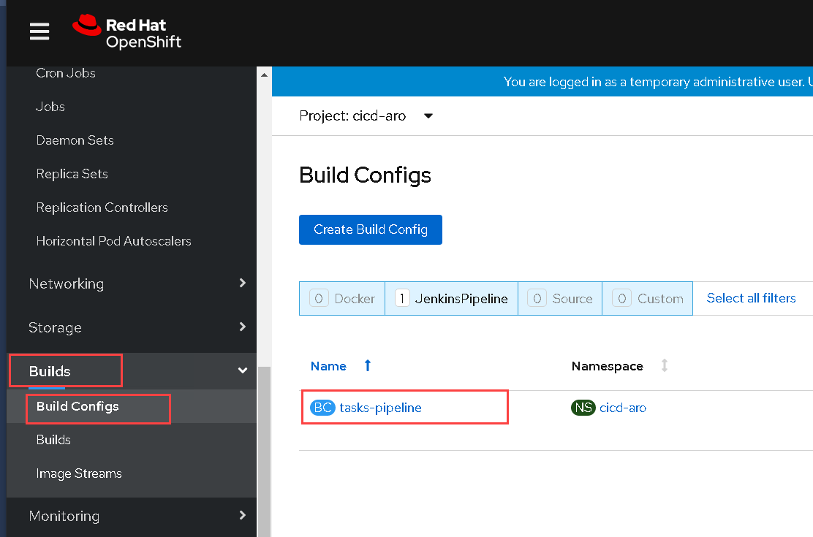
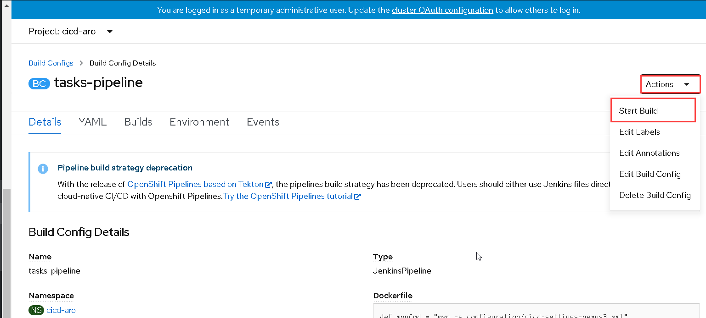
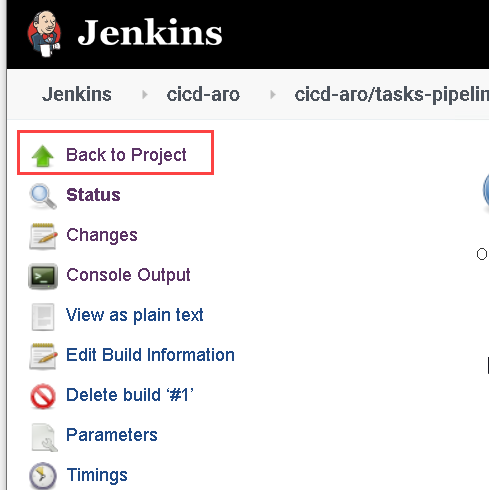
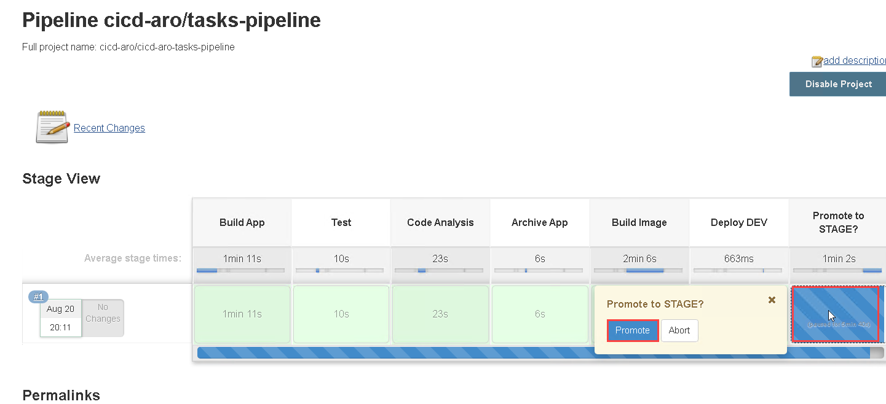

### Run the CI/CD Pipeline

A CI/CD pipeline is created by the demo provision script. Please review the pipeline and trigger an execution.



On OpenShift Web Console, Navigate to project `cicd-aro`. From the side navigation menu, select menu item `Builds`, then select`Build Configs`. 

You will see there is a pipeline, named `tasks-pipeline`. Click on the name of the pipeline, then you will see the pipeline overview page. In the tab `Configuration`, you will see the definition of the pipeline.



To run the pipeline, click on button `Actions`and select `Start Build` from the dropdown. Then Azure Red Hat OpenShift will start a new execution instance for that pipeline.




### Monitor the pipeline

After triggering a pipeline execution, please monitor the execution on the web console.



You will see the execution result of each stage of the pipeline.


For detail information, you can click on the link `View Log` of a execution instance to review the real time log output. After clicking `View Log`, you will be navigated to the Jenkins login page. Login with OpenShift credentials and grant all the required permissions to Jenkins, then you will see the log output in Jenkins.




### Approve pipeline task

You may define steps which required user intervention. You can either approve the request in Azure Red Hat OpenShift web console, or in Jenkins. Please allow the pipeline to promote the deployment from project `Dev` to `Stage`.


When the pipeline execution runs to stage 'Promote to STAGE?' You will see the pipeline is paused and asking for your input.


Click on the link `Input Required` , and you will be navigated to Jenkins. Click `Back to Project` button and the click on the `Promote` buttion in Jenkins to resume the pipeline build.

<\br>





### Verify the results

After the pipeline execution is completed, please review the execution result on the web console. You also can login to the Jenkins console to check out the detail.


If everything works fine, you will be albe to see all pipeline stages completed successfully, as it shown below. The sample application was built and deployed into project `Dev` and `Stage`.


You can checkout the status of the application pods in project `Dev` and `Stage`. Following are the commands and sample output.
```sh
$ oc get pod -n dev-aro
NAME            READY     STATUS      RESTARTS   AGE
tasks-1-build   0/1       Completed   0          9m
tasks-3-59x64   1/1       Running     0          8m
```

```sh
$ oc get pod -n stage-aro
NAME            READY     STATUS    RESTARTS   AGE
tasks-4-v8fzt   1/1       Running   0          7m
```

You can also get the Route of your deployment in project `Dev` or `Stage`, then access the deployment with the URL, in a web browser.

```sh
$ oc get route -n dev-aro
NAME      HOST/PORT                                                  PATH      SERVICES   PORT      TERMINATION   WILDCARD
tasks     tasks-dev-aro.apps.xxxxxxxxxxxx.eastus.azmosa.io             tasks      8080                    None

```

